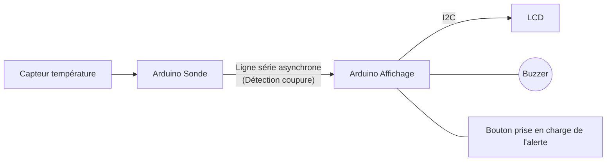

# Compte-Rendu : Surveillance de Température & Climatisation de la Salle Serveur

## 1. Contexte
* **Configuration de la pièce :** Pièce fermée hébergeant des équipements informatiques (Serveur).
* **Système actuel :** Climatisation sans diffusion spécifique.
## . Schéma d'Implantation (Disposition)

```text
+----------------------------------------------------------+
|  PIÈCE FERMÉE                                            |
|                                                          |
|   +-------------------+             +----------------+   |
|   |   SERVEUR (S)     |             |    CLIM (C)    |   |
|   +-------------------+             +----------------+   |
|                                                          |
|                                                          |
+----------------------------------------------------------+
```

## 2. Expression du Besoin
* **Problématique :** Risque pour les serveurs en cas de défaillance du système de climatisation.
* **Objectif principal :** Assurer une surveillance continue pour garantir que la pièce reste correctement climatisée et être alerte immédiatement en cas d'élévation ou baisse anormale de la température.

## 3. Objectifs
* **Matériel à rajouter :** Un **thermomètre connecté** (sonde de température réseau / IoT).
* **Fonctions :** Mesure en temps réel et transmission d'alertes en cas de surchauffe.
 e 
## 4. Spécifications & Contraintes Techniques
* **Connectivité :** Appareil connecté (envoi des métriques à distance).
* **Raccordement Électrique :**
  * **Alimentation :** Réseau électrique du **serveur**.
  * **Interdiction :** **Ne pas brancher sur le réseau électrique de la climatisation**.
  * *Raison :* Permet de conserver la surveillance et l'envoi d'alertes même en cas de disjonction ou de panne électrique du circuit de la climatisation.

---
